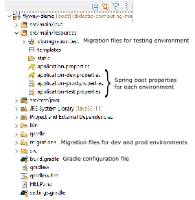

# Flyway for Database Versioning
This repo is part of [Flyway for Database Versioning](https://danieljalopes.hashnode.dev/01-flyway-for-database-versioning).

# Flyway

An application life cicle includes also changing the database. So there is a need to evolve the database, keep track of its modifications in its many environments, share the changes amongst all developers and apply the changes in an ordelry and consistent way.

Flyway is a tool dedicated to database versioning. It can organise and apply database changes with minimum developer intervention.

# Concepts
## Migrations
Every script ceated to change the database is called "migration". The name of each migration file follows a namming convention that allows to keep the files in the order they must be executed so the database can be created/modified properly.

Flyway adheres to the following naming convention for migration scripts:

> \<Prefix\>\<Version\>__\<Description\>.sql

Where:
**Prefix** – The default prefix is V, which we can change in the above configuration file using the Flyway.sqlMigrationPrefix property.
**Version** – Migration version number. Major and minor versions may be separated by an underscore. The migration version should always start with 1.
**Description** – Textual description of the migration. A double underscore separates the description from the version numbers.

Example: V1.1__create_users_table.sql

## History table
In order to keep track of applyed migrations, Flyway maintains a table for that - Flyway_schema_history. The table is used to check if

## Commands
Flyway supports the following basic commands to manage database migrations:
- Info: Prints current status/version of a database schema. It prints which migrations are pending, which migrations have been applied, the status of applied migrations, and when they were applied.
- Migrate: Migrates a database schema to the current version. It scans the classpath for available migrations and applies pending migrations.
- Baseline: Baselines an existing database, excluding all migrations, including baselineVersion. Baseline helps to start with Flyway in an existing database. Newer migrations can then be applied normally.
- Validate: Validates current database schema against available migrations.
- Repair: Repairs metadata table.
- Clean: Drops all objects in a configured schema. Of course, we should never use clean on any production database.


# The demo project
This is a simple Spring Boot 2 application that is configured to work in 3 profiles testing (test), development (dev) and production (prod).

The following image describes the main elements needed for the correct project setup




# How to run
## Start Databases

Open a command line terminal on folder 01_Flyway
Run the following command:
````
docker-compose up -d
````
This will launch 3 databases dedicated to it's own environment: testing (test), development (dev) and production (prod)

## Databases URL Connections
- test: localhost:65434
- dev: localhost:65432
- prod: localhost:65433

## Start web app
All the follwoing steps must be runned under 01_Flyway/flyway-demo folder
### Profile DEV
1. Run Flyway migrations:
````
.\gradlew -Dflyway.configFiles=.\migrations\dev\Flyway.conf FlywayMigrate
````
2. Start webapp:
````
.\gradlew bootRunDev
````

### Profile PROD
1. Run Flyway migrations:
````
.\gradlew -Dflyway.configFiles=.\migrations\prod\Flyway.conf FlywayMigrate
````
2. Start webapp:
````
.\gradlew bootRunProd
````

## Testing
Just run 
````
.\gradlew test 
````
This will automatically run Flyway migrations and execute tests

## Using the webappp
The app has two REST endpoints where one can test the data on thje database on profiles dev and prod

Getting a list of all users


Getting a message of a user


# References
https://flywaydb.org/documentation

https://www.baeldung.com/database-migrations-with-flyway

https://flywaydb.org/blog/organising-your-migrations

https://dbabulletin.com/index.php/2018/03/29/best-practices-using-flyway-for-database-migrations/